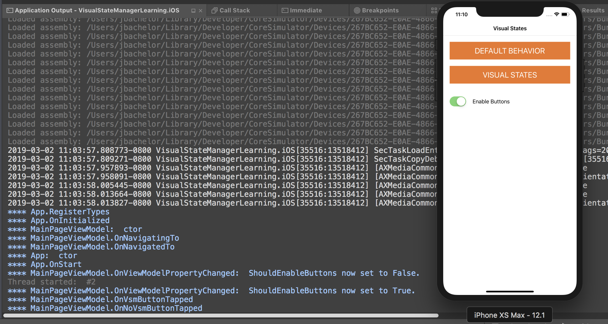
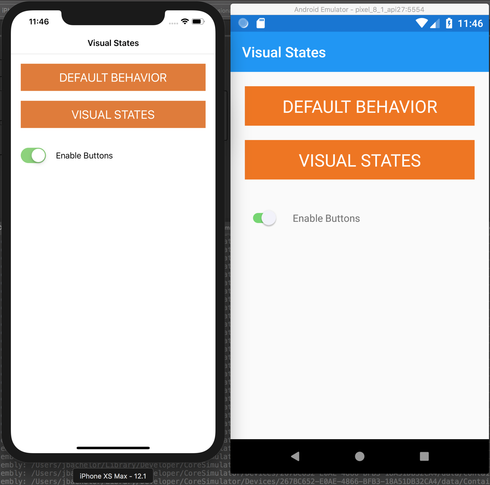
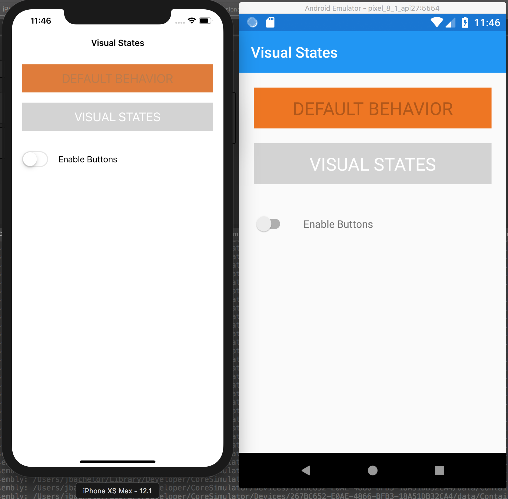

# XamFormsVisualStateManager
This is a small demo app to show how to use the [VisualStateManager](https://docs.microsoft.com/en-us/xamarin/xamarin-forms/user-interface/visual-state-manager) in Xamarin.Forms to control the look of controls depending on the value of their [IsEnabled](https://docs.microsoft.com/en-us/dotnet/api/xamarin.forms.visualelement.isenabled?view=xamarin-forms) property. This is just the tip of the VisualStateManager iceberg, but it's a great place to start.

## Why is this sample here?
It was not too long ago when I thought I had almost no control at all over how various view elements would look in Xamarin.Forms when their IsEnabled property would get set to false. The stages of discovery went a little something like this:
1. Holy guacamole... I have no control whatsoever over how a button looks when it is disabled!
2. I'm so, so, so, sad... In order to control the look when disabled, I'm going to have to write a [custom renderer](https://docs.microsoft.com/en-us/xamarin/xamarin-forms/app-fundamentals/custom-renderer/introduction).
3. Well, at least I have some limited control over the disabled look using [styles](https://docs.microsoft.com/en-us/xamarin/xamarin-forms/user-interface/styles/xaml/index) and a [data trigger](https://docs.microsoft.com/en-us/xamarin/xamarin-forms/app-fundamentals/triggers) based on the value of IsEnabled. Still pretty icky UI.
4. Rejoice!! The VisualStateManager gives me complete control over the look when disabled without delving into the bowels of each platform for a custom renderer!

Furthermore, I am a huge fan of the the [Prism MVVM framework](https://prismlibrary.github.io/) in conjunction with Xamarin.Forms, and I believe the more sample code available the better! This demo app will show you how to customize the look of a styled button when it is disabled, in a very simple Xamarin.Forms app using the Prism MVVM framework.

***
## Keep an eye on your ApplicationOutput pad/tab
There are Debug.WriteLine calls throughout the sample code to illustrate app flow, show you when the buttons are responding to taps, etc.

***
## Enabled Look

***
## Disabled Look

